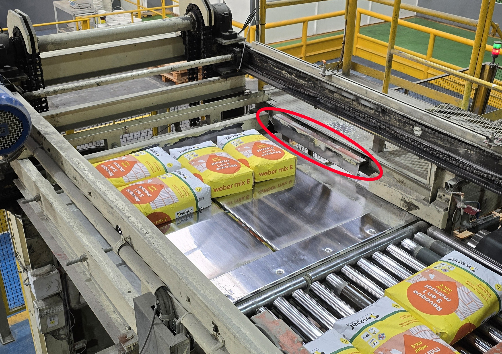
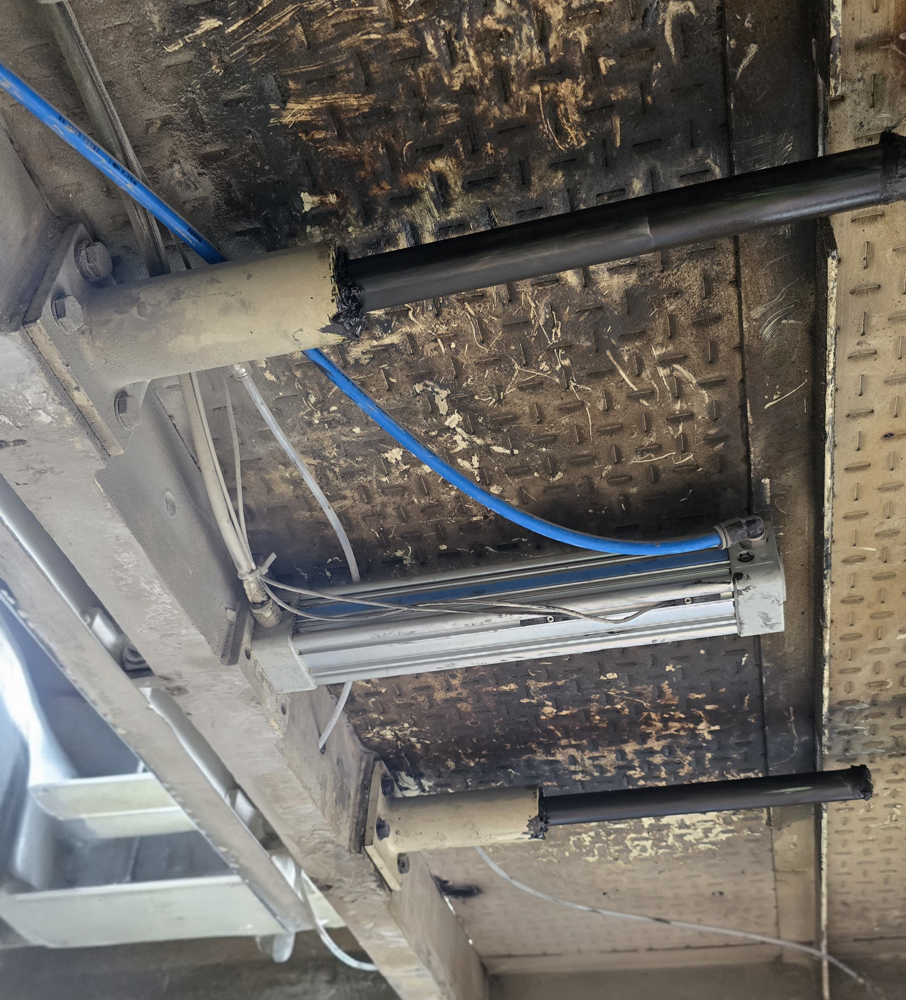
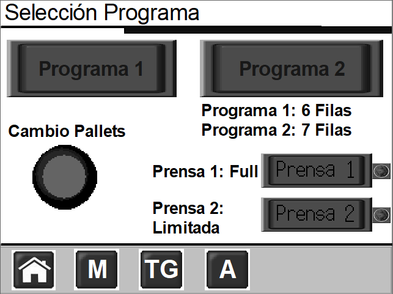
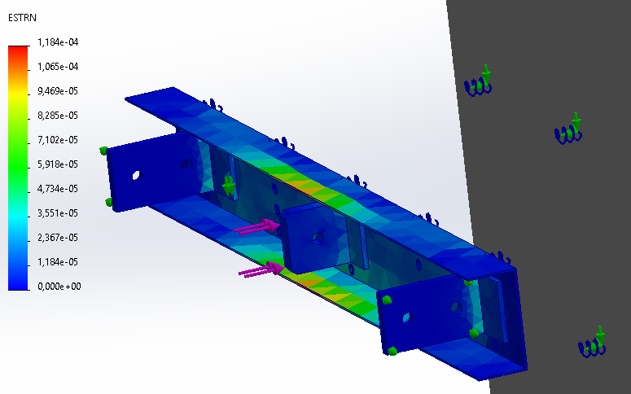

# PPS – Control Mecatrónico de Prensa Lateral en Paletizadora Industrial

**Práctica Profesional Supervisada – Ingeniería Mecatrónica**  
**Universidad Nacional de Lomas de Zamora – Facultad de Ingeniería**

<!-- (Opcional) Logo
<p align="left">
  
</p>
-->

---

## 📑 Índice
1. [Introducción](#-introducción)
2. [Objetivo](#-objetivo)
3. [Sistema intervenido](#-sistema-intervenido)
4. [Solución implementada](#-solución-implementada)
   - [Modos FULL / LIMITADO](#-modos-full--limitado)
   - [PLC – Señales y lógica](#-plc--señales-y-lógica)
   - [HMI – Selección de modo](#-hmi--selección-de-modo)
   - [Sensor IFM MR0120 – Montaje y conexión](#-sensor-ifm-mr0120--montaje-y-conexión)
   - [Consideración neumática](#-consideración-neumática)
5. [Análisis mecánico](#-análisis-mecánico)
6. [Estructura del repositorio](#-estructura-del-repositorio)
7. [Cómo abrir y utilizar los proyectos](#-cómo-abrir-y-utilizar-los-proyectos)
8. [Archivos incluidos](#-archivos-incluidos)
9. [Autor](#-autor)

---

## 📌 Introducción

Este repositorio documenta el desarrollo de una **Práctica Profesional Supervisada (PPS)** realizada sobre un equipo industrial real: una **paletizadora automática** equipada con una **prensa lateral neumática**.

La mejora consistió en incorporar un **modo de prensado limitado** configurable desde HMI mediante un **sensor magnético ON/OFF (IFM MR0120)**, manteniendo la **secuencia** y **temporizaciones originales** del ciclo.

📷 **Vista general del equipo / zona de prensado**  


---

## 🎯 Objetivo

Implementé una mejora de control para **limitar el recorrido del cilindro neumático** según necesidad operativa, sin modificar:

- la secuencia automática existente,
- las temporizaciones originales del ciclo,
- el comportamiento manual ya validado.

La solución permite detener el avance del cilindro en una posición intermedia definida por sensor, **manteniendo presión durante el tiempo original de prensado**.

---

## 🏭 Sistema intervenido

- **PLC:** Omron CJ2M-CPU34  
- **HMI:** Omron NS5  
- **Software PLC:** CX-Programmer  
- **Software HMI:** CX-Designer  
- **Cilindro neumático:** Micro 0.049.260.300 (doble efecto, con imán, carrera 300 mm)  
- **Electroválvula:** 5/3 centro cerrado  
- **Sensor agregado:** IFM MR0120 (magnético ON/OFF)

📷 **Zona de contacto efectiva (vista superior / capa prensada)**  


📷 **(Opcional) Conjunto / croquis mecánico**  


---

## ⚙️ Solución implementada

### 🔹 Modos FULL / LIMITADO

**Modo FULL**
- Comportamiento idéntico al original.
- El cilindro avanza a carrera completa.
- El sensor es ignorado por lógica.

**Modo LIMITADO**
- El avance se detiene cuando el sensor detecta el imán del pistón.
- Se conserva el tiempo de prensado del ciclo.
- El retroceso ocurre por la lógica global existente, sin agregar pasos nuevos.

---

### 🧠 PLC – Señales y lógica

**Entrada digital (sensor):**
- `S_PRENSA_LIMIT` → **CIO 3.14**

**Bit de modo (desde HMI):**
- `PRENSA_MODO_LIMITADO` → **CIO 610.09**
  - `0` = FULL (recorrido completo)
  - `1` = LIMITADO (recorrido limitado por sensor)

**Bit interno (bloqueo):**
- `BLOQUEO_PRENSA_LIMIT` → **W500.00**

**Cálculo del bloqueo:**
- `BLOQUEO_PRENSA_LIMIT = PRENSA_MODO_LIMITADO AND S_PRENSA_LIMIT`

**Acción sobre el avance (Y12):**
- Se agregó `NOT BLOQUEO_PRENSA_LIMIT` en los rungs que energizan el avance.
- En FULL, la lógica queda equivalente al programa original.
- En LIMITADO, al activarse el sensor se impide continuar el avance.

📷 **Rungs principales (avance/retorno) – referencia visual**  


**Retroceso (Y34):**
- Se mantuvo el criterio del ciclo existente, evitando dobles mandos y conservando la secuencia validada.

---

### 🖥️ HMI – Selección de modo

La pantalla modificada fue **0011 – Programa**.  
Los Programas 1 y 2 escriben en **DM200** (selección de receta/ciclo), por lo que el modo FULL/LIMITADO se definió como **configuración global** independiente del programa activo.

Se agregaron dos botones con indicación por lámpara:

- **Prensa FULL:** escribe `0` en `HOST3:00610.09`
- **Prensa LIMITADA:** escribe `1` en `HOST3:00610.09`

📷 **Pantalla HMI (selección FULL / LIMITADO)**  


---

### 🔌 Sensor IFM MR0120 – Montaje y conexión

El sensor IFM MR0120 se monta sobre el cuerpo del cilindro y detecta el imán del pistón en una posición intermedia definida en la puesta a punto.

📷 **Sensor montado en cilindro**  


**Conexión eléctrica (lógica PLC):**
- El sensor se cableó a la **entrada digital CIO 3.14** (`S_PRENSA_LIMIT`).

**Conexión física (dónde va el cable):**
- **PLC:** Omron CJ2M-CPU34  
- **Módulo de entradas:** **CJ1W-ID211 (DC Input Unit)**  
- **Ubicación:** Bastidor principal – **Slot 03**  
- **Borne:** **Entrada digital Nº14** del módulo (asociada a **CIO 3.14**)

> Nota: en Omron, el banco **CIO 3.xx** corresponde al módulo cuyo número de unidad/slot es **03** (16 entradas → 3.00 a 3.15).  
> Por eso **3.14** refiere a la entrada 14 de ese módulo.

**Recomendaciones de instalación:**
- Ajustar la posición del sensor según el recorrido máximo deseado.
- Verificar repetibilidad de la señal antes de habilitar el modo LIMITADO.
- Asegurar fijación mecánica firme para evitar desplazamientos por vibración.

---

### ⚠️ Consideración neumática

Se recomienda instalar una **válvula estranguladora antirretorno** para regular la velocidad del cilindro durante el avance.

**Motivo:**
- Evitar que el avance sea tan rápido que supere el punto del sensor antes de ser leído por el PLC.
- Mejorar confiabilidad de detección sin afectar el prensado.

**Ajuste recomendado:**
- Evitar estrangular en exceso (riesgo de no alcanzar el prensado a tiempo).
- Evitar estrangular de menos (riesgo de sobrepaso del punto de detección).

---

## 🧮 Análisis mecánico

Se calculó la fuerza de avance del cilindro a 6,5 bar y se verificó el conjunto mediante simulación estática (tensiones y desplazamientos).  
El análisis permitió concluir que la estructura trabaja con margen de seguridad y que el fenómeno de sobreprensado se relaciona principalmente con el recorrido impuesto y la compresibilidad del producto.

📷 **Configuración / reacciones (referencia de carga)**  


📷 **Resultado (deformación / criterio comparativo)**  


---

## 📁 Estructura del repositorio

```text
docs/        → Informe final (PPS)
plc/         → Proyecto PLC (.cxp) + backups (.bak) + config (.opt) + PDFs
hmi/         → Proyecto HMI (.ipp) + capturas
mecanica/    → Modelos CAD (fuente)
imagenes/    → Imágenes utilizadas en este README y mas
anexos/      → Documentación complementaria
```

---

## 🧰 Cómo abrir y utilizar los proyectos

### PLC (Omron CJ2M – CX-Programmer)
1. Abrí **CX-Programmer**.
2. Ir a **File → Open…** y seleccioná el archivo del proyecto:
   - `plc/*.cxp`
3. (Opcional) Si necesitás ver el hardware configurado:
   - **PLC → I/O Table and Unit Setup** (o “Tabla de E/S” según versión).
4. Para revisar la lógica modificada:
   - Buscar las señales/símbolos:
     - `S_PRENSA_LIMIT` (CIO 3.14)
     - `PRENSA_MODO_LIMITADO` (CIO 610.09)
     - `BLOQUEO_PRENSA_LIMIT` (W500.00)
   - Ver rungs de:
     - `Y12` (EV. SALE PRENSA LATERAL)
     - `Y34` (EV. ENTRA PRENSA LATERAL)
5. Si se realiza prueba en banco/planta:
   - Conectar al PLC (USB/Serial/Ethernet según configuración del equipo).
   - **Online → Work Online**.
   - Monitorear el bit `BLOQUEO_PRENSA_LIMIT` y la entrada `CIO 3.14` al accionar el cilindro.

> ⚠️ Importante: este repositorio documenta una mejora sobre un equipo industrial real. Cualquier puesta en marcha debe respetar permisos, procedimientos internos y condiciones de seguridad del área.


### HMI (Omron NS5 – CX-Designer)
1. Abrí **CX-Designer**.
2. Ir a **File → Open…** y seleccioná:
   - `hmi/*.ipp`
3. Navegar a la pantalla modificada:
   - **Pantalla 0011 – Programa**
4. Verificar los objetos agregados:
   - Botón **Prensa FULL** → escribe `0` en `HOST3:00610.09`
   - Botón **Prensa LIMITADA** → escribe `1` en `HOST3:00610.09`
   - Lámparas asociadas al estado del bit `610.09`


### Sensor IFM MR0120 (montaje y conexión resumida)
- **Conexión lógica PLC:** `CIO 3.14` (`S_PRENSA_LIMIT`)
- **Conexión física (según tabla E/S):**
  - **Módulo:** `CJ1W-ID211` (DC Input Unit)
  - **Bastidor principal – Slot 03**
  - **Borne:** **Entrada digital Nº14** del módulo

> 🔧 Recomendación: ajustar una **válvula estranguladora antirretorno** para controlar la velocidad de avance del cilindro y asegurar detección confiable del sensor sin afectar el prensado.


---

## 📦 Archivos incluidos

### PLC
- `plc/*.cxp` → Proyecto principal de PLC (CX-Programmer).
- `plc/*.bak` → Backups históricos del proyecto.
- `plc/*.opt` → Configuraciones/opciones del proyecto (si aplica).
- `plc/*.pdf` → Exportaciones en PDF del programa (automático / manuales / general).

### HMI
- `hmi/*.ipp` → Proyecto HMI (CX-Designer).
- `hmi/*.png` / `hmi/*.jpg` → Capturas de pantalla de la interfaz.

### Mecánica
- `mecanica/*.SLDPRT` / `mecanica/*.SLDASM` → Modelos CAD (SolidWorks).
- `mecanica/*` (Simulation) → Archivos asociados a simulación (resultados y configuraciones).
- `mecanica/*.pdf` → Reportes/exportaciones de simulación y resultados.
- `mecanica/*.png` / `mecanica/*.jpg` → Capturas (cargas, restricciones, tensiones, deformaciones).

### Documentación
- `docs/*.pdf` → Informe final de la PPS.
- `anexos/*.pdf` → Catálogos, fichas técnicas, documentación complementaria.
- `imagenes/*` → Imágenes utilizadas en este README.


---

## 👤 Autor

**Alejo Salto**  
Ingeniería Mecatrónica – Universidad Nacional de Lomas de Zamora (FI-UNLZ)
